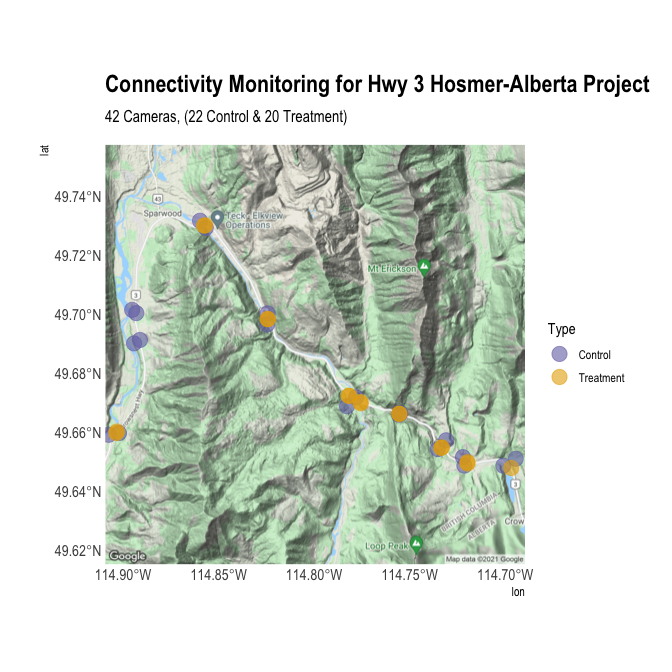

Reconnecting the Rockies:BC early results
================
Clayton Lamb
24 April, 2021

## Load Packages & Data

``` r
library(here)
library(raster)
library(sf)
library(ggmap)
library(mapview)
library(rgdal)
library(hrbrthemes)
library(RColorBrewer)
library(gitignore)
library(tidyverse)

##################  
##LOAD DATA
################## 

##camera deployments
cams <- read_csv(here::here("data","Camera Deployment.csv"))

##scored photos
df <- read_csv(here::here("data","Highway_3_Wildlife_Collision_Reduction_2020_WILDTRAX_REPORT.csv"))
```

## Map of cams

``` r
##make spatial
cams <- st_as_sf(cams,
               coords=c("Location (longitude)", "Location (latitude)"),
               crs=4326)
##map
# register_google("ADD OWN TOKEN HERE")
# basemap <- ggmap::get_map(location = c(lat = 49.686547, lon =-114.799671),zoom=12)
# saveRDS(basemap,file=here::here("data","basemap.rds"))
 basemap <- readRDS(here::here("data","basemap.rds"))

##kmz
st_write(cams%>%select(Name=`Camera Name`), here::here("data", "hwycams_all.kml"), driver = "kml", delete_dsn = TRUE)


##drop cams not in use
cams_active <- cams%>%
  filter(is.na(`Date Removed`))

##stats
stats <-paste0(n_distinct(cams_active%>%pull(`Camera Name`)), " Cameras, (",
               n_distinct(cams_active%>%filter(Type%in%"Control")%>%pull(`Camera Name`))," Control & ",
               n_distinct(cams_active%>%filter(Type%in%"Treatment")%>%pull(`Camera Name`))," Treatment)")


cols <- brewer.pal(n = 8, name = "Dark2")[c(3,6)]
ggmap(basemap)+
  geom_sf(data=cams_active, aes(color=Type),size=5, alpha=0.6,inherit.aes = FALSE)+
  labs(subtitle=stats)+
  theme_ipsum()+
  scale_color_manual(values=cols)+
  ggtitle("Connectivity Monitoring for Hwy 3 Hosmer-Alberta Project")
```

<!-- -->

``` r
ggsave(here::here("plots","map_active.png"), height=7, width=7, unit="in")

##kmz
st_write(cams_active%>%select(Name=`Camera Name`), here::here("data", "hwycams_active.kml"), driver = "kml", delete_dsn = TRUE)
```
